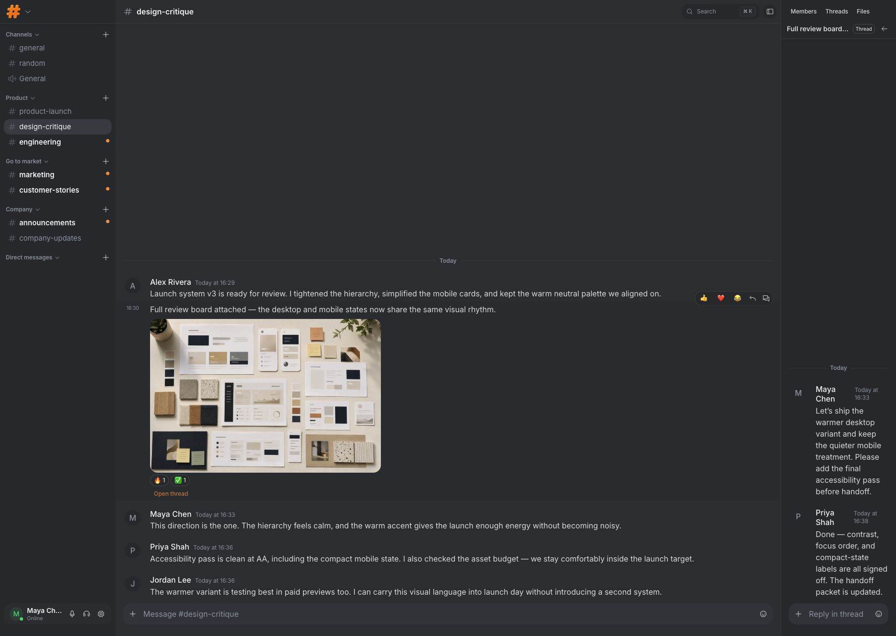
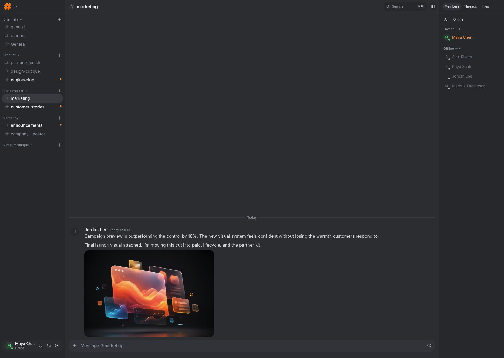
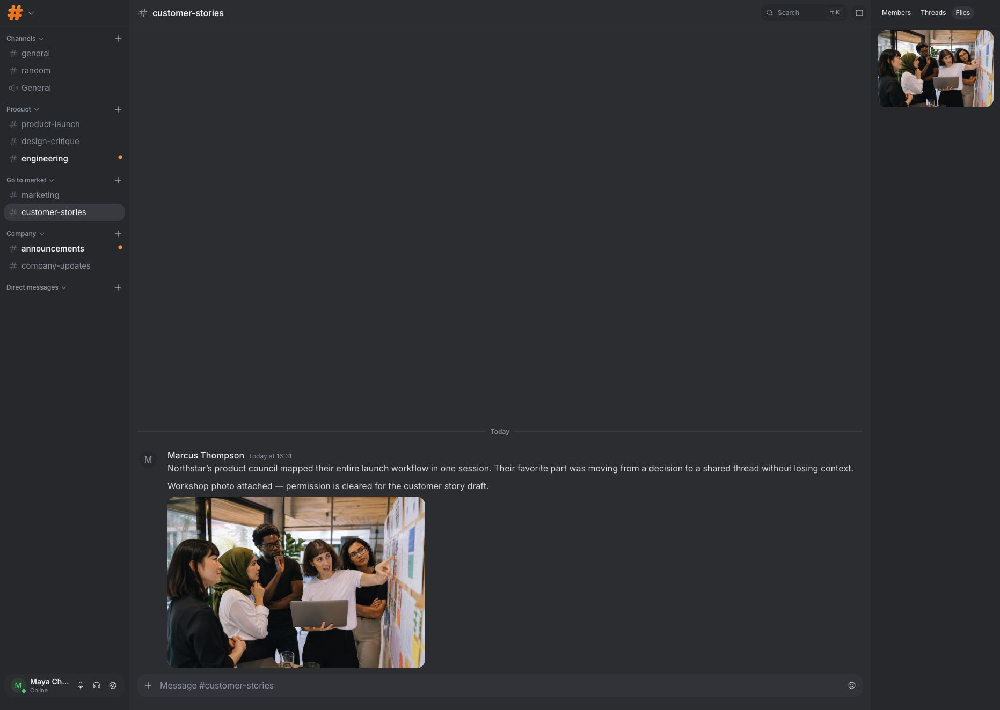

# Discoflare

Self-hosted team chat that runs on your Cloudflare account.

[Website](https://discoflare.com) · [Sandbox](https://sandbox.discoflare.com) · [Architecture](docs/architecture.md) · [Deployment guide](docs/deployment.md) · MIT licensed

[](https://deploy.workers.cloudflare.com/?url=https://github.com/vnmtvlv/discoflare)

<p align="center">
  
</p>

<table>
  <tr>
    <td width="50%">
      
    </td>
    <td width="50%">
      
    </td>
  </tr>
  <tr>
    <td align="center"><sub><strong>Campaign assets</strong> · Feedback stays beside the work.</sub></td>
    <td align="center"><sub><strong>Customer stories</strong> · Files stay with their conversation.</sub></td>
  </tr>
</table>

Discoflare gives a team one private, real-time workspace without an origin server or hosted application database. The Worker, data, files, and live connections stay in the Cloudflare account you control.

## What you can do

- Create public and private text channels.
- Chat in real time with Direct Messages, typing, presence, unread state, replies, threads, reactions, and mentions.
- Upload attachments to your own R2 bucket.
- Start voice huddles with Cloudflare RealtimeKit.
- Invite members and manage roles, permissions, workspace settings, and audit history.
- Sign in with email and password, or optionally with X.

## How it works

One Nuxt Worker serves the app and API. D1 stores workspace and message history, R2 stores attachments, KV holds short-lived WebSocket tickets, and Durable Objects coordinate live channels, presence, and rate limits. RealtimeKit carries huddle media; it never passes through Discoflare's Durable Objects.

```
Browser ──HTTP /api/*─────────► Nuxt Worker ── D1 / R2 / KV
        ──WS /ws/channel/:id──► Channel DO (messages and typing)
        ──WS /ws/workspace/:id► Workspace DO (presence)
Huddle media ────────────────► RealtimeKit
```

## Deploy

Click **Deploy to Cloudflare** above, keep the Worker name as `discoflare`, and enter `AUTH_SECRET`, `ADMIN_EMAIL`, `ADMIN_PASSWORD`, and `ADMIN_NAME`. Cloudflare provisions the declared D1 database, R2 bucket, KV namespace, and Durable Objects.

The first health request applies the bootstrap and creates the owner and workspace. `/setup` reports readiness; it cannot be used to claim an unconfigured installation. The source repository must be public before the deploy button can clone it.

Optional huddles and X sign-in need additional secrets. See the [deployment guide](docs/deployment.md) for the exact callback URL and configuration.

Manual deployment:

```bash
pnpm install
pnpm deploy
```

### Docker / Coolify

The published container runs the same built Worker locally with persistent D1, R2, KV, and Durable Object simulations:

```bash
docker compose up -d
```

Set `PUBLIC_ORIGIN`, `AUTH_SECRET`, `ADMIN_EMAIL`, `ADMIN_PASSWORD`, and `ADMIN_NAME` before starting. In Coolify, deploy the root `docker-compose.yml` in normal Docker Compose mode and route the `discoflare` service to port `3000`; Coolify supplies the proxy labels. Keep exactly one replica and back up the `discoflare-data` volume with the container stopped.

The multi-architecture image is published at `ghcr.io/vnmtvlv/discoflare`. Huddles still require RealtimeKit connectivity; text chat and attachments use the local persistent volume. See the [deployment guide](docs/deployment.md#docker--coolify).

## Local development

```bash
pnpm install
pnpm env:init
pnpm db:migrate:local
pnpm dev
```

For production-equivalent WebSockets and Durable Object hibernation:

```bash
pnpm dev:full
```

To run the current code against the disposable pilot environment, configure `.env.sandbox` and use `pnpm dev:sandbox`. This mutates the real sandbox resources; see the [sandbox development guide](docs/sandbox-development.md).

`pnpm env:init` creates or completes `.env`, generates `AUTH_SECRET`, and preserves existing values. Edit the owner values before first boot. To add local sample users:

```bash
pnpm db:seed
```

Text chat works without RealtimeKit. When huddle secrets are absent, the app remains usable and explains the missing configuration.

## Scripts

| Script | |
|---|---|
| `pnpm dev` | Nuxt + local bindings |
| `pnpm dev:full` | wrangler dev on the built Worker |
| `pnpm dev:sandbox` | remote preview against sandbox resources |
| `pnpm env:init` | safely initialize `.env` from `.env.example` |
| `pnpm deploy` | build + remote D1 migration + wrangler deploy |
| `pnpm db:migrate:local` | apply D1 SQL locally |
| `pnpm typecheck` | `nuxt typecheck` |
| `pnpm test` | unit tests |

## License

[MIT](LICENSE)
